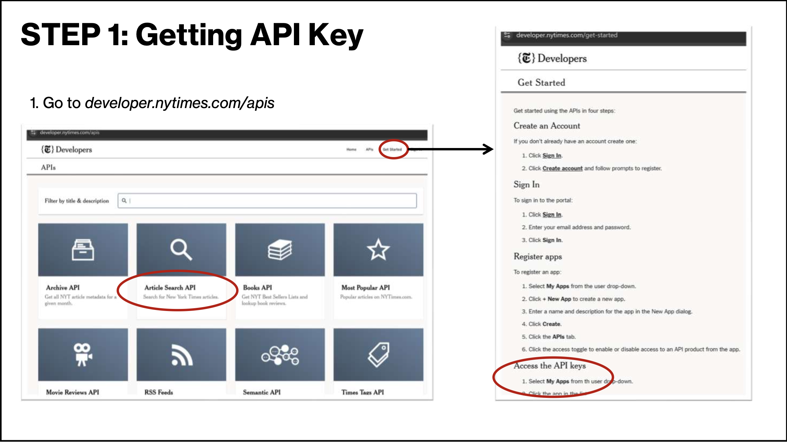
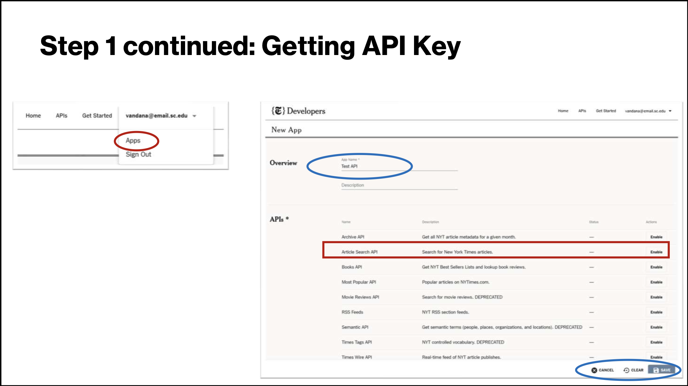
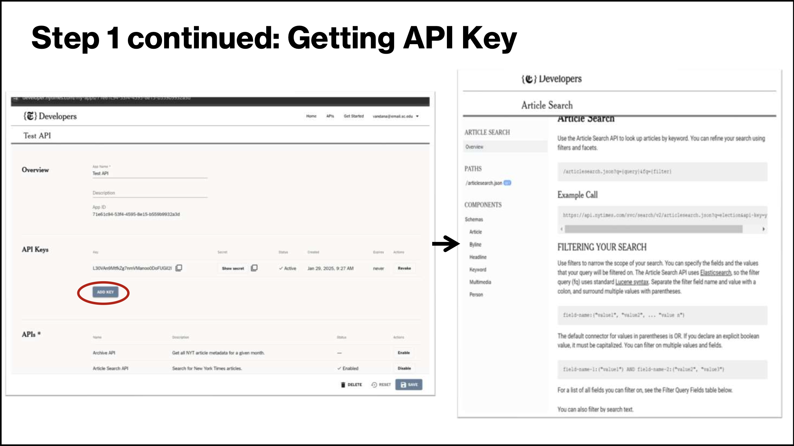
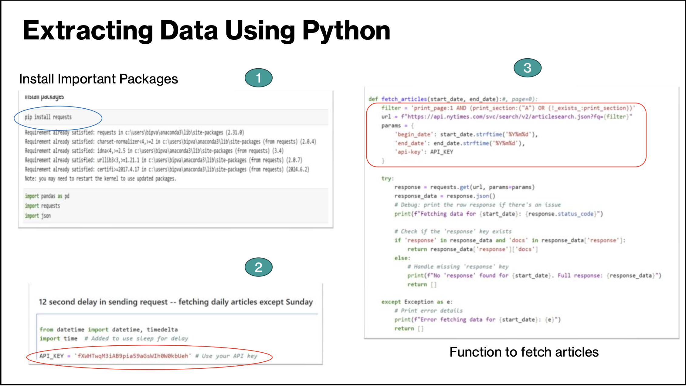
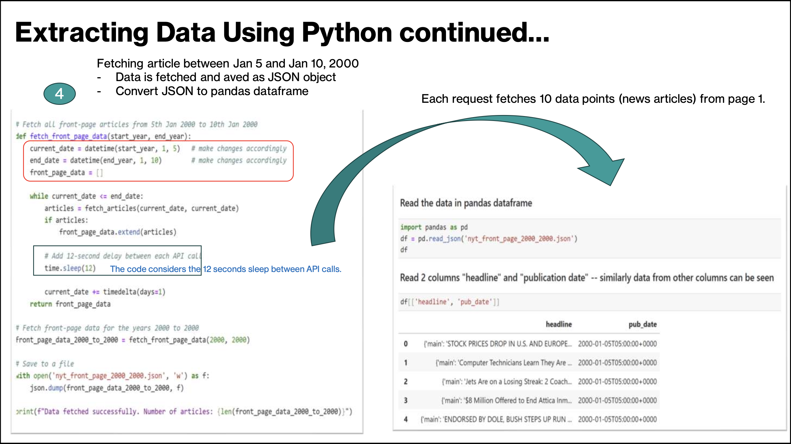
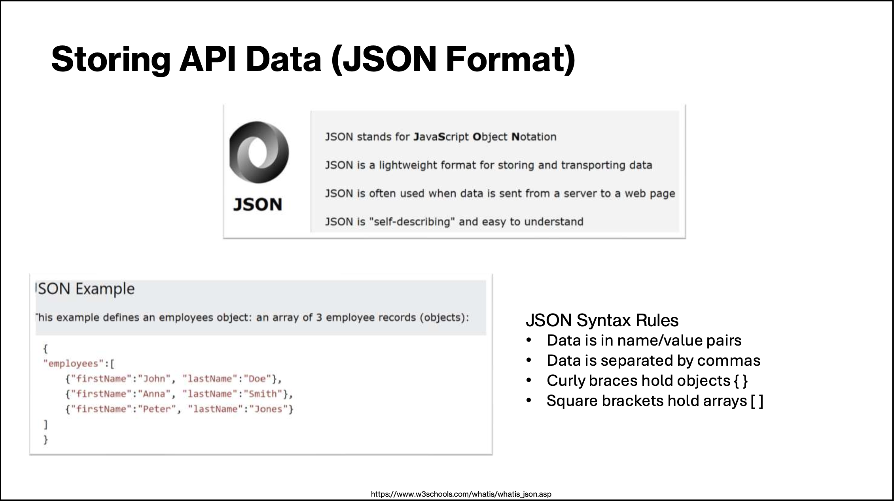

# Extracting Data From Websites Using API - A Beginners Guide
By Vandana Srivastava  
   AI/Data Science Specialist, University Libraries, USC

## Definition and Purpose of APIs
**What is an API?**
- **A**pplication **P**rogramming **I**nterface
- An API defines the methods and data formats that applications use to communicate effectively with each other. 

**Purpose of APIs**  
The primary purpose of APIs is to enable <u>integration between different software applications,</u> enhancing functionality and interoperability.

**Benefits for Developers**  
APIs allow developers to leverage existing services without rebuilding them, saving time and resources in the development process.

## How API Works?
- API allows communication and sharing of information or data between two programs or softwares
- To get a desired information from the server, you as the client would **send a request**
   - which is a combination of URL and HTTP methods.
   - In addition to the method, we can <u>also add request parameter or header</u> to modify the response we get from the server, sent by the API.
- Using API to extract data is straight forward
  - it provides access to dedicated section of the required data through an endpoint
  - Reduces time to extract data 
  
## Types of APIs (REST, SOAP, GraphQL)
**REST APIs**  
REST APIs use a **stateless communication*** protocol and are widely
used for web services, enabling scalability and flexibility.

**SOAP APIs**
SOAP APIs are protocol-based and rely on XML for message
formatting, providing a rigid structure and robust security features.

**GraphQL APIs**
GraphQL allows clients to request exactly the data they need, making
it efficient and flexible for modern applications. 

* each request from a client to the server is treated
independently, and the server does not maintain any
session information or state between requests, requiring
all necessary data to be included within each request
itself.

## Common Use Cases for APIs
**Data Retrieval**  
APIs enable the retrieval of data from online services, allowing
applications to access real-time information easily.

**Application Integration**  
APIs facilitate the integration of third-party applications, enhancing functionality and interoperability between different systems.

**Task Automation**  
APIs are used to automate repetitive tasks, making processes more efficient and reducing manual effort.

**Payment Processing**  
APIs simplify payment processing, allowing businesses to securely handle transactions through various payment gateways.

## Registering and Obtaining API Keys
**Account Registration**  
To start using an API, you must first register for an account with the API provider.

**Obtaining API Keys**  
After registration, you can request your unique API keys, which are essential for accessing the API.

**Authentication Process**
API keys are used to authenticate your requests, ensuring secure access to the API's resources.

## API Documentation and Endpoints
**Importance of API Documentation**  
API documentation is essential for developers as it guides them in understanding how to properly use an API.

**Endpoints and Methods**  
Understanding endpoints and request methods is vital for making successful API calls and ensuring proper data retrieval.

**Parameters and Response Formats**  
Documentation includes details on parameters and response formats, crucial for handling requests and interpreting responses correctly.

## Authentication and Authorization Methods
**Importance of Authentication**  
Authentication is essential for APIs to verify user identity and protect sensitive data from unauthorized access.

**API Keys**  
API keys are unique identifiers used to authenticate requests made to an API, providing a basic level of security.

**OAuth Tokens**  
OAuth tokens allow users to grant third-party applications access to their data without sharing passwords, enhancing security.\

**Basic Authentication**  
Basic Authentication encodes user credentials in a simple format, but is less secure compared to other methods.

## Use Case: Extracting NY Times Article Data Using Their API

### Step 0: What Data Should Be Extracted
- **Decide on the kind of data you are interested in.**
- For example, we are interested in:  
  Extracting articles from first page of the NY Times newspaper since 2000  

- **Read website requirements and specs for downloading data using API**
  - New York Times has rate limits to call their API.
  - They allow 500 requests per day and 5 requests per minute.
  - You should sleep 12 seconds between calls to avoid hitting the per minute rate limit.
  - If you need a higher rate limit, pleact contact code@nytimes.com  
      [NY Times FAQ](https://developer.nytimes.com/faq).

### Step 1: Getting API Key
1. Go to <i>developer.nytimes.com/apis</i>  

  

 

  

 

  

### Extracting Data Using Python

 

### Storing API Data

### Making API Requests (GET, POST, PUT, DELETE)
**GET Method**  
The GET method is used to retrieve data from a server. It is the most commonly used HTTP request method.

**POST Method**  
The POST method is used to send data to a server. It is typically used for submitting forms or creating new resources.

**PUT Method**  
The PUT method is used to update existing data on a server. It replaces the current representation of the target resource.

**DELETE Method**  
The DELETE method is used to remove data from a server. It is a way to delete resources from a web application.

### Handling Responses and Error Codes

**Importance of Response Handling**  
Proper response handling is crucial for understanding the data returned by API calls and ensuring correct application behavior.

**Parsing Returned Data**  
Parsing the returned data allows developers to extract necessary information and utilize it effectively within applications.

**Managing Error Codes**  
Managing error codes is essential for troubleshooting and ensuring that applications can gracefully handle unexpected issues.

## Data Processing and Storage
### Storing Data in Databases
**Importance of Storage**  
Storing processed data correctly in a database is essential for maintaining data integrity and availability.

**Choosing the Right Database**  
Selecting the appropriate database system is crucial for achieving optimal performance and scalability based on the data needs.

**Schema Design**  
Effective schema design is key to ensuring efficient data retrieval and management within the database.

### Data Cleaning and Validation
**Importance of Data Accuracy**  
Ensuring data accuracy is crucial for making informed decisions based on reliable information.

**Filtering Invalid Entries**  
The cleaning process involves identifying and removing invalid or irrelevant data entries to improve data quality.

**Correcting Inconsistencies**  
Data validation includes correcting discrepancies in datasets to maintain uniformity and reliability.

## Best Practices and Considerations
### Optimizing Performance and Efficiency
**API Performance Optimization**  
Optimizing API calls can significantly enhance application performance by reducing latency and improving response times.

**Caching Responses**  
Implementing caching mechanisms for API responses helps in reducing repeated data fetches, leading to improved efficiency.

**Minimizing Request Payloads**  
Reducing the size of request payloads can decrease processing time and enhance overall application speed.

### Monitoring and Maintaining APIs
**Importance of Monitoring**  
Regular monitoring is essential to maintain the performance of API integrations and prevent disruptions in service.

**Tracking Usage Patterns**  
Keeping track of usage patterns helps identify trends and optimize API performance based on user needs.

**Updating API Keys**  
Regularly updating API keys is crucial for security and ensuring uninterrupted access to API services.

**Troubleshooting Issues**  
Prompt troubleshooting of issues as they arise ensures that API integrations continue to function smoothly.

